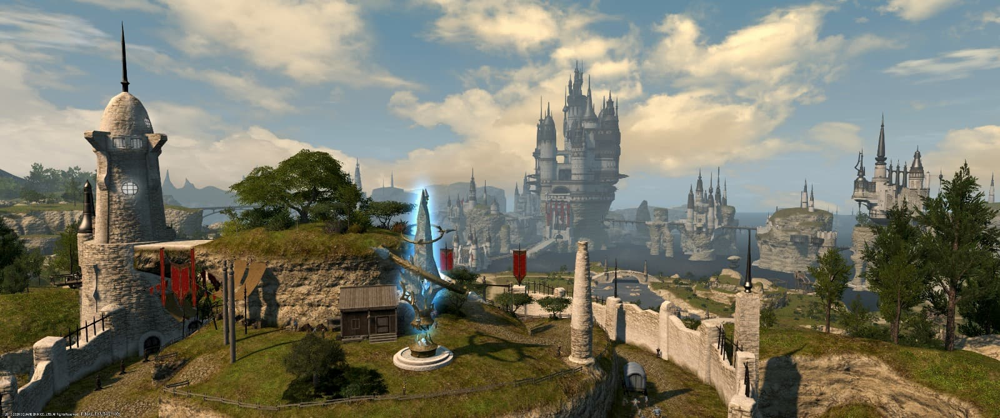
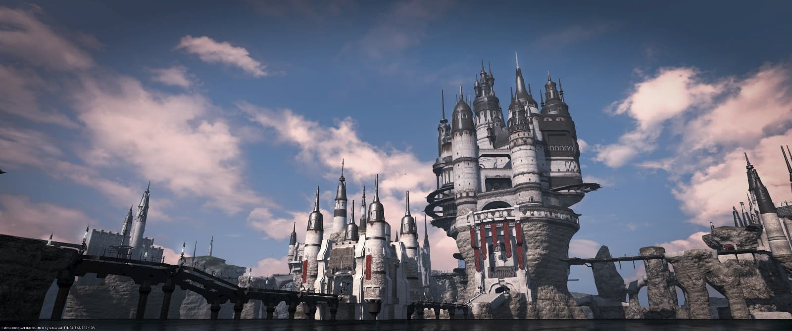
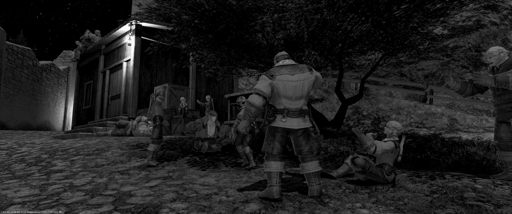

中央ラノシアへと入植した者たちの経営する果樹園で知られる地、サマーフォード庄。

海洋都市国家リムサ・ロミンサの君主であるメルウィヴ提督の入植政策により、熟達した園芸師と船を失うなどして海賊を引退した農夫らが共同で入植し暮らしている土地だ。ラノシアオレンジの産地として知られているが、一見地味ともされる農業へ従事することに不満を持つ元海賊の農夫も多く、園芸師らとの軋轢が問題となりつつあるようだ。

